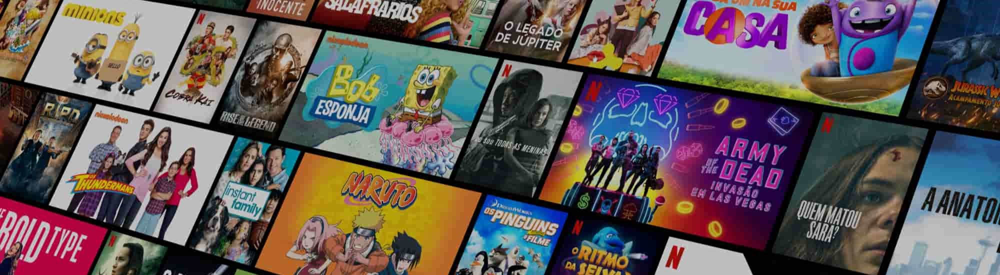

# 🎬 CineDB Oracle

Bem-vindo ao CineDB, um projeto de banco de dados Oracle criado para centralizar e organizar informações completas sobre o universo cinematográfico. Este banco de dados guarda dados sobre atores, diretores, produtores, roteiristas, gêneros, premiações e avaliações de críticos e espectadores. 🌟🎥

## 🍿 Objetivos do Projeto

1. **Centralizar Informações:** Unificar dados dispersos da indústria cinematográfica para facilitar o acesso a informações completas e detalhadas.

2. **Facilitar Análises Profundas:** Possibilitar análises estatísticas e insights valiosos para pesquisadores, entusiastas e profissionais do cinema.

3. **Oferecer Facilidade de Uso:** Tornar a exploração e administração do banco de dados intuitiva, mesmo para usuários menos experientes em sistemas Oracle.

4. **Promover a Colaboração:** Estimular a colaboração entre profissionais da indústria, pesquisadores e entusiastas, criando uma fonte valiosa de conhecimento cinematográfico.

## 🤝 Como Contribuir
Se você é um amante do cinema e deseja contribuir para a expansão do CineDB, siga estas etapas:

1. Faça um fork do repositório.
2. Crie uma branch para suas alterações: `git checkout -b feature/nova-feature`.
3. Realize suas contribuições e faça commit: `git commit -m 'Adiciona nova funcionalidade'`.
4. Faça push para a branch: `git push origin feature/nova-feature`.
5. Abra um Pull Request e participe da construção do futuro do CineDB.

## 📄 Licença
Este projeto é licenciado sob a [Licença MIT](LICENSE). 
